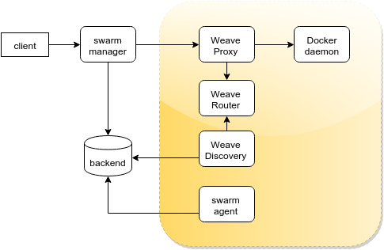

*Note*: This is an experimental feature which has issues.  We welcome contributions from the community to improve it.

Discovery
=========

Weave Discovery retrieves and watches the list of peers
in a Weave network from a discovery backend.
Discovery uses this information for telling a Weave Router
about new peers it must connect to, as well as peers
that are not available anymore and must be forgotten.
Discovery can also advertise the Weave Router in the
same backend so other peers can join it.

Installation
============

Just download the `discovery` script from the repository,
or use this URL:

```
curl -L -O https://raw.githubusercontent.com/weaveworks/discovery/master/discovery
chmod a+x discovery
```

This will download the `discovery` script to the current
directory.

Usage
=====

Once you have the script, joining a new discovery URL
is as simple as running:

```
$ ./discovery join <URL>
```

where the endpoint URL can be something like

- `etcd://<etcd_ip>/<path>`
- `consul://<consul_addr>/<path>`
- `zk://<zookeeper_addr1>,<zookeeper_addr2>/<path>`
- `token://<swarm_cluster_id>`
- `file://<path>`

Example:

```
$ ./discovery join etcd://192.168.9.1/mycluster
```

(you can get more information about the supported backends
as well as the URL formats [here](https://github.com/docker/swarm/tree/master/discovery))

The discovery endpoint must provide a valid list of peers
(as `IP:port` of Weave routers) that will be part of
the network. This information can be filled up manually,
but Discovery can automatically advertise its Router with the 
`--advertise-router` flag:

```
$ ./discovery join --advertise-router etcd://192.168.9.1/mynetwork
```

This will advertise the local router using then IP of the
default interface. But sometimes it can be useful to
advertise a particular `IP:port` instead of the automatically
obtained values (for example, when using a non standard port).
In this case, the `--advertise` argument will do the job:

```
$ ./discovery join --advertise=193.144.60.100:16783 etcd://192.168.9.1/mynetwork
```

Discovery could also advertise the guessed external IP with
the `--advertise-external` flag. However this will not perform
any NAT mapping, so make sure the router is accessible at this
IP _and_ port by the rest of the peers in the backend.

By default, Discovery will configure the Weave Router in the
local machine. However, you can point Discovery to a
different Router with the `--weave` flag. For example, we
could point Discovery to the Weave HTTP API found
at _192.168.9.3:6784_ with:

```
$ ./discovery join --weave=192.168.9.3:6784 etcd://192.168.9.1/mynetwork
```

Using Discovery with Swarm
==========================

Discovery uses the same backends used by [Docker Swarm](https://docs.docker.com/swarm/),
so the same endpoint used for keeping the list of Swarm nodes
can be also used for keeping the list of peers in the Weave
network.

In this case, for each node in the cluster, you should:

  * launch the Weave Router, Proxy and Discovery
  * launch the Swarm agent, advertising the Proxy `IP:port` (eg, `10.246.2.2:12375`)

The Swarm Agent will register the Proxy `IP:port` in the discovery
backend, so you don't need to `--advertise` anything from Discovery:
Swarm will do it for you.

However, Swarm will advertise the Proxy IP _and port_. While
the IP is correct, the port is not the port where a Weave Router
is listening at. You must fix this by replacing the port discovered
by the port where the Router can be found:

```
$ ./discovery join --discovered-port=6783 etcd://192.168.9.1/mynetwork
```

Note that this presents a limitation when using Discovery with Swarm:
all the Routers must be located at the same port (and you must
specify that port on the `--discovered-port` arguments).

Example
-------

A Vagrant file has been included for testing the functionaly
of Discovery with Swarm. The Vagrant will start three VMs,
each one with: 

  * a Weave router and proxy
  * a Swarm agent that uses some _token_ and points to the
  Weave proxy
  * a Discovery instance that uses the same _token_ and points
  to the Weave router



You can launch the Vagrant VMs with:

```
	$ vagrant up --provision
```

Machines will be provisioned and a new Swarm token ID will be
automatically generated. You will see the ID in the console
messages. After a few seconds, you will be able to check the
list of peers that have successfully registered in this
token with:

```
	$ swarm list token://<TOKEN>
	10.246.2.3:12375
	10.246.2.4:12375
	10.246.2.2:12375
```

You can start the cluster manager in the host machine (or in any
other machine with connectivity to the Vagrants, like another VM):

```
	$ docker run -d -p 22375:2375 swarm manage token://<TOKEN>
```

This Swarm manager will then provide a Docker API at port 22375.
Point your Docker client to this port for getting the list of the
machines in the cluster with:

```
	$ docker -H 127.0.0.1:22375 info
	
	Containers: 17
    Images: 26
    Storage Driver: 
    Role: primary
    Strategy: spread
    Filters: affinity, health, constraint, port, dependency
    Nodes: 3
     minion-0: 10.246.2.2:12375
      └ Containers: 6
      └ Reserved CPUs: 0 / 2
      └ Reserved Memory: 0 B / 2.052 GiB
      └ Labels: executiondriver=native-0.2, kernelversion=3.19.0-21-generic, operatingsystem=Ubuntu 15.04, storagedriver=overlay
     minion-1: 10.246.2.3:12375
      └ Containers: 6
      └ Reserved CPUs: 0 / 2
      └ Reserved Memory: 0 B / 2.052 GiB
      └ Labels: executiondriver=native-0.2, kernelversion=3.19.0-21-generic, operatingsystem=Ubuntu 15.04, storagedriver=overlay
     minion-2: 10.246.2.4:12375
      └ Containers: 5
      └ Reserved CPUs: 0 / 2
      └ Reserved Memory: 0 B / 2.052 GiB
      └ Labels: executiondriver=native-0.2, kernelversion=3.19.0-21-generic, operatingsystem=Ubuntu 15.04, storagedriver=overlay
    Execution Driver: 
    Kernel Version: 
    Operating System: 
    CPUs: 6
    Total Memory: 6.155 GiB
    Name: 
    ID: 
```

Now you can run a Ubuntu shell in _some_ machine in the cluster, with:

```
	$ docker -H 127.0.0.1:22375 run -ti  ubuntu
	root@7f1007c28c1c:/# 
```

and this container will be automatically attached to the Weave network.

